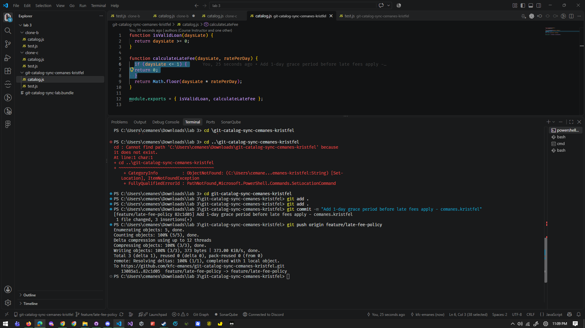
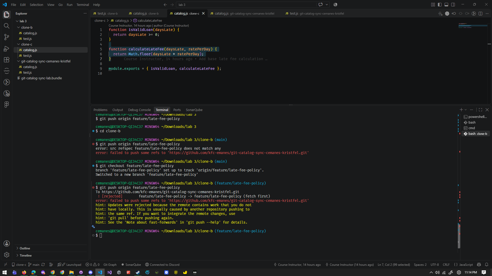
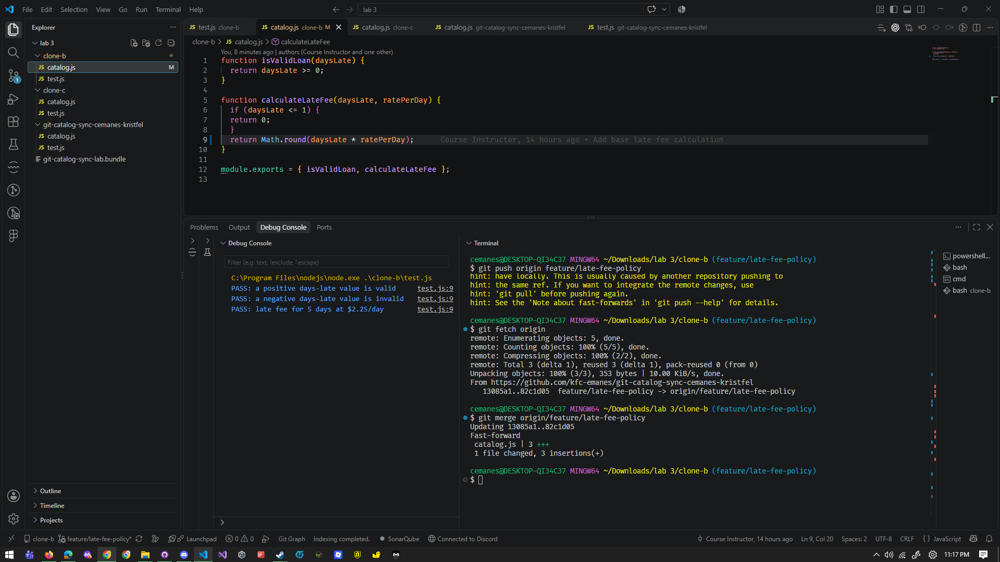
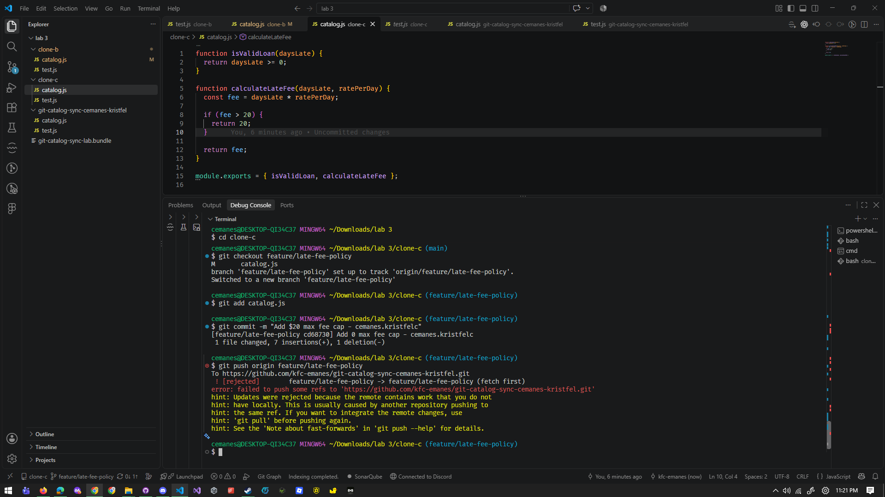
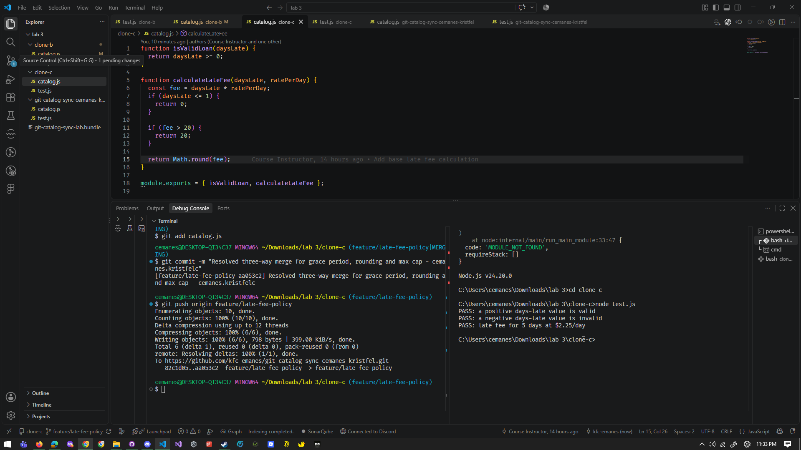
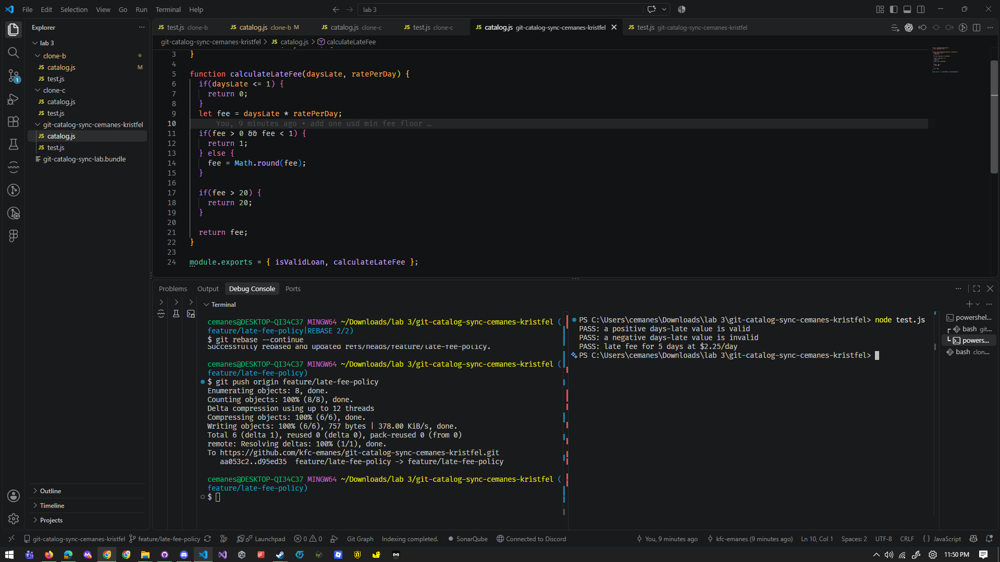
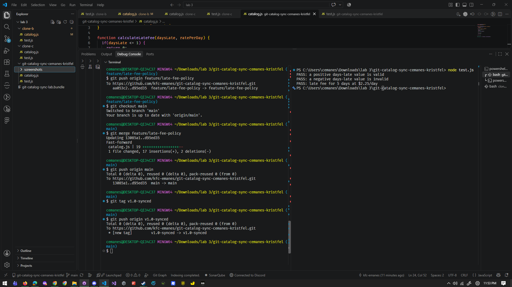

## SCREENSHOTS ##

### Task 2: Rejected Push from Clone B

### Task 3: Two-Way Merge Resolution

### Task 4: Rejected Push from Clone C

### Task 5: Three-Way Merge Resolution

### Task 6: Rebase Resolution

### Task 7: Main Merge & Tagging

## BULLET POINT 1 ##
function calculateLateFee(daysLate, ratePerDay) {

    //1. Grace Period, Implemented by Clone A in Task 1
  if(daysLate <= 1) {
    return 0;
  }
  let fee = daysLate * ratePerDay;

    //2. 1USD Minimum Fee, Implemented by Clone A in Task 6
  if(fee > 0 && fee < 1) {
    return 1;
  } 
  
  //3. Fee Rounding, Implemented by Clone B in Task 2
  else {
    fee = Math.round(fee);
  }

  //4. 20USD Max Fee Cap, Implemented by Clone C in Task 4

  if(fee > 20) {
    return 20;
  }

  return fee;
}

## BULLET POINT 2 ##
Two-way merges only evaluate conflicts between the local branch and one remote state. A three-way merge lets a third independent set of modifications intersect the same lines of code, which exponentially increases the complexity of conflict markers which causes you to mentally, and simultaneously, mend and reconcile three distinct functional requirements (in this case the grace period, te rounding and the maximum cap) without breaking the logic.

## BULLET POINT 3 ##
Task 5 combined the diverging branches by creating a brand new merge commit that preserves the history of both branches, while task 6 temporarily unhooks the local commits, updates the base reference to the latest remote state and replays local commits one by one on top of it, producing a clean and linear hstory without extra merge commits.

## BULLET POINT 4 ##
If this was real, there would have been a strict enforcement of frequent communication and regular synchronization (git pulling or git fetching + rebasing) before beginning local work or pushing changes, combined with small and incremental pull requests instead of isolated, long-running local branch work which could lead to the entire debacle from before which consumed quite a lot of time and energy.